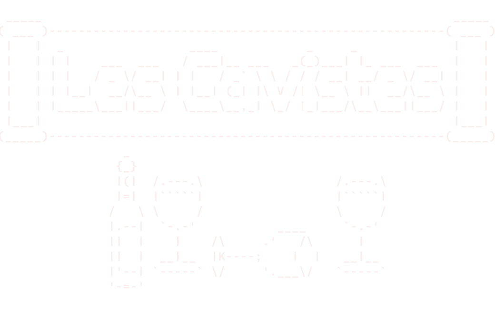

# Les Cavistes

We are a three students team from the CNAM school in Paris. We are currently working on a project for our second semester.
We worked on a fullstasck app written in SvelteKit for the front and Rust in the backed.

## The repos
- [Backend](https://github.com/Les-Cavistes/project-semester-2-back)
- [Frontend](https://github.com/Les-Cavistes/project-semester-2-front)

## The team

- [Guillian Celle](https://github.com/Glacoon).
- [Nils Galloux](https://github.com/ninouGx).
- [Tom Planche](https://github.com/tomPlanche).
